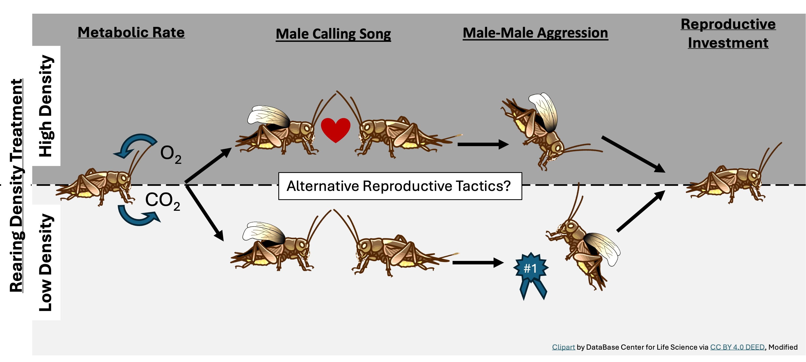

# House cricket males reared at different perceived acoustic population densities differ in adult behaviour but not physiology

The following data are provided as a reference for the associated publication in [Ecological Entomology](https://doi.org/10.1111/een.13354). 

Access PDF: [View PDF](./manuscript.pdf)

## Who:

> > 👩 Authors: **Brandi Pessman**, Rosaria J. Rae, Veronica Wagner, and Chandryee Mitra

> > 🦗 S️tudy Organism: *Acheta domesticus* (the common house cricket)

## What:
1. If environments stay relatively constant over an individual’s lifetime, a juvenile that
accurately perceives environmental conditions, like population density, may adjust
adult traits to better match their environment, thereby increasing success. While
previous studies have explored how adult exposure to population density affects
physiological and behavioural plasticity, the influence of juvenile density experience
on adult traits is less studied.
2. Using the common house cricket, Acheta domesticus, we explored whether perceived
acoustic population density during development affected adult physiology
and behaviour. We simulated high- and low-densities using live ambient male song.
Upon maturation, we measured metabolic (resting respiration) rate, reproductive
investment (testes and accessory gland masses), calling song characteristics and
aggressive behaviours from pairwise contests between males from different
densities.
3. Male rearing density did not affect resting metabolic rates or reproductive organ
masses. However, high-density males had significantly faster, longer chirps, with
more pulses—known to be preferred by females—and higher dominant frequency.
Low-density males won more aggressive contests and sang the aggressive song
more. Initiation of aggressive behaviours or song and singing more aggressive song
were the only other significant predictors of contest outcome.
4. These results suggest that males may plastically adjust calling song characteristics
and aggressive behaviour, but not physiology, based on perceived density during
development. We hypothesize that alternative mating tactics—that is, territory
guarding versus attractive song production—may underlie these observed patterns.
5. Overall, our study highlights the significant influence of early-life biotic environments
on adult behavioural decisions to enhance success in diverse environments.

## When:

> > 📓 Date Collected: summer 2017

> > 📖 Date Published: May 8, 2024

## Where:

> > 📓 Data collected in: Naperville, Illinois

> > 📖 Data published in: *Ecological Entomology*

## Why:

The results of this study lead us to hypothesize that male A.
domesticus may invest in more aggressively guarding a territory or in
producing more attractive songs as alternative mating tactics depending
on the perceived density that they were reared in. We have shown
that juvenile A. domesticus can take in information about their external
biotic environment via acoustic cues and change their behaviours in
adulthood. These changes in behaviour may allow individuals to
achieve higher fitness in either low-density or high-density environments.
Since aggressive contests entail higher risks of injury and
energy loss, the tactic may be more advantageous in low-density conditions
when the probability of coming across a potential competitor
is much lower than in a high-density environment. Conversely, producing
an attractive song may help a male standout to a female when
there are many other potential suitors present. This last hypothesis
needs further testing to see whether females show preference for
high-density male calling song.

## How:

> > 💻 IBM SPSS Statistics 25

Analyses include:

- backwards stepwise ANCOVA
- Mann-Whitney U-test
- ANOVA
- Pearson correlation
